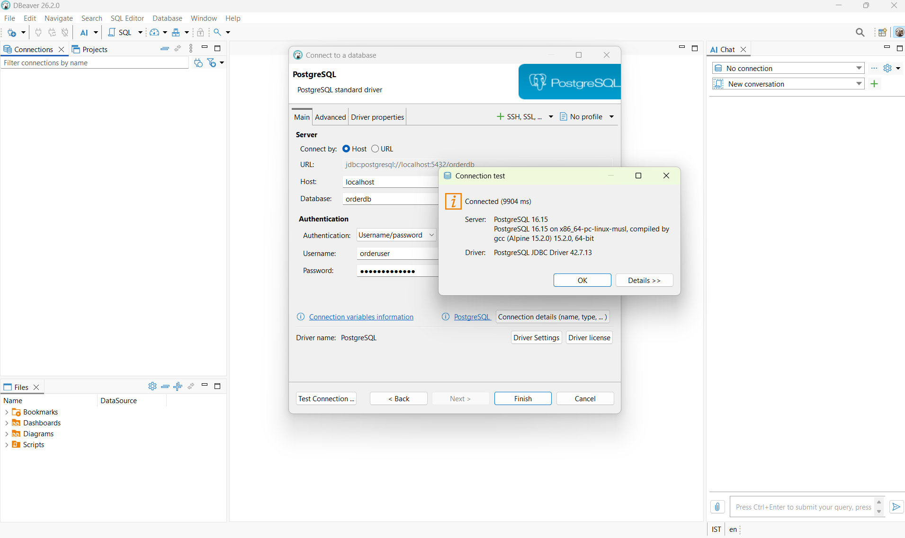

# DBeaver Setup
after installing DBeaver

Since your PostgreSQL container exposes 5432:5432, you can inspect the orders table directly in DBeaver.

1. Create the connection in DBeaver
```
Open DBeaver → Database → New Database Connection → PostgreSQL.
```
Enter:
```
Host:     localhost
Port:     5432
Database: orderdb
Username: orderuser
Password: orderpassword
```
Click Test Connection → it should say Connected.



2. Find the orders table

In the left Database Navigator, expand:
```
PostgreSQL
└── Databases
    └── orderdb
        └── Schemas
            └── public
                └── Tables
                    └── orders
```
If you don't see orders, right-click Tables → Refresh.


3. See the orders data

Right-click:
```
orders
```
Then select:

View Data → All Rows

DBeaver will show something like:

| id | customer_id | status     | total_amount |
| -- | ----------- | ---------- | -----------: |
| 1  | CUST-001    | PENDING    |         1500 |
| 2  | CUST-002    | PROCESSING |         2500 |

4. Or use SQL — recommended

**Open SQL Editor for orderdb and run:**
```
SELECT *
FROM orders;
```
**Or:**
```
SELECT id, status, total_amount
FROM orders
ORDER BY id DESC;
```

If you DON'T see orders

This is important: DBeaver showing no orders table doesn't necessarily mean PostgreSQL is broken.

**Your Docker Compose only creates the database:**
```
orderdb
```
The orders table must be created by your FastAPI application's migrations, usually with Alembic.

**You can check from DBeaver:**
```
SELECT table_name
FROM information_schema.tables
WHERE table_schema = 'public';
```
If orders isn't listed, your database tables haven't been created yet.

If you show me your backend folder structure or Alembic files, I can tell you exactly how to create the orders table in your project.