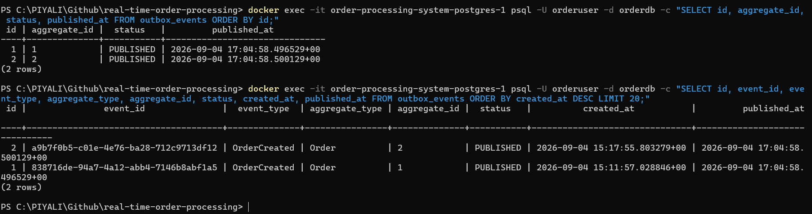
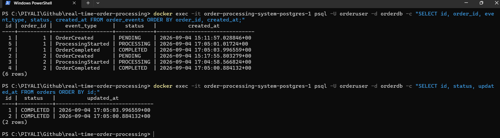

# Kafka → worker → PostgreSQL → frontend real-time update flow.

| Service         | Expected behavior                              |
| --------------- | ---------------------------------------------- |
| `outbox-worker` | ♻️ Runs forever, repeatedly polls DB           |
| `order-worker`  | ♻️ Runs forever, waits/consumes Kafka messages |
| `notif-worker`  | ♻️ Runs forever, waits/consumes Kafka messages |
| `api`           | 🌐 Runs forever, serves HTTP requests          |
| `postgres`      | 🗄️ Runs forever                               |
| `kafka`         | 📨 Runs forever                                |

Your architecture should be:
```
Angular
   │
   │ POST /orders
   ▼
FastAPI
   │
   │ save order = PENDING
   ▼
PostgreSQL
   │
   │ Outbox record
   ▼
Outbox Worker
   │
   │ Kafka event
   ▼
Kafka
   │
   ▼
Order Worker
   │
   │ update DB
   ▼
PostgreSQL
   │
   │ PROCESSING / COMPLETED
   ▼
WebSocket / polling
   │
   ▼
Angular
```

```
Angular 21
   │
   │ POST /orders
   ▼
FastAPI
   │
   ├── orders → PENDING
   └── outbox_events → PENDING
                 │
                 ▼
           outbox-worker
                 │
                 ▼
              Kafka
          order.created
                 │
                 ▼
           order-worker
                 │
       ┌─────────┴─────────┐
       ▼                   ▼
  PROCESSING           COMPLETED
       │                   │
       └─────────┬─────────┘
                 ▼
             PostgreSQL
```
And your supporting tables give you:
```
orders
    └── current state

order_events
    └── state/event history

outbox_events
    └── reliable Kafka publishing

processed_events
    └── idempotency / duplicate protection
```

## 1. First check the workers

Run:
```
docker compose logs --tail=100 order-worker
```
Then:
```
docker compose logs --tail=100 outbox-worker
```
And:
```
docker compose logs --tail=100 notif-worker
```

Look especially for:
```
ERROR
Exception
Traceback
Kafka
consumer
database
commit
timeout
```

## 2. Check whether Kafka is receiving events

Run:
```
docker compose logs --tail=100 kafka
```
But more importantly, let's see the topics:
```
docker exec -it order-processing-system-kafka-1 \
  /opt/kafka/bin/kafka-topics.sh \
  --bootstrap-server localhost:9092 \
  --list
```
You should see your order-related topic(s), for example:
```
order.created
order.processing
order.completed
```
The exact names depend on your application.

## 3. Check PostgreSQL directly

This is the most important test.

Enter PostgreSQL:
```
docker exec -it order-processing-system-postgres-1 \
  psql -U orderuser -d orderdb
```
Then:
```
SELECT id, status, created_at
FROM orders
ORDER BY created_at DESC
LIMIT 10;
```
If the latest order is:
```
id        status
--------  ----------
abc123    PENDING
```
then we know the problem is after order creation.

If it becomes:
```
abc123    PROCESSING
```
but never becomes COMPLETED, then the problem is inside the order worker/business processing.

If PostgreSQL becomes:
```
COMPLETED
```
but Angular still shows:
```
PENDING
```
then the backend is working and the problem is specifically the Angular real-time status update.

## We can narrow it down very quickly

There are basically four possibilities:

### Case A — DB remains PENDING
```
Angular
   ↓
FastAPI
   ↓
Postgres = PENDING
   ↓
❌ Outbox/Kafka flow
```
Check:
```
docker compose logs outbox-worker
```

### Case B — DB changes to PROCESSING but not COMPLETED
```
Postgres
   ↓
PENDING
   ↓
PROCESSING
   ↓
❌ COMPLETED
```
Check:
```
docker compose logs order-worker
```
This usually means the worker received the event but failed during processing.

### Case C — DB is COMPLETED but UI says PENDING
```
Postgres = COMPLETED
        │
        ▼
     Backend
        │
        ▼
   ❌ WebSocket/event
        │
        ▼
Angular = PENDING
```
Then we investigate your Angular Signals/WebSocket code.

### Case D — Kafka event never gets consumed
```
FastAPI
   ↓
Outbox
   ↓
Kafka
   ↓
❌ order-worker
```

Then we'll inspect:
- Kafka topic
- consumer group
- consumer connection
- event payload
- worker subscription

## Do these 3 commands first

Don't change the code yet.
```
docker compose logs --tail=100 outbox-worker
```
```
docker compose logs --tail=100 order-worker
```
```
docker exec -it order-processing-system-postgres-1 \
  psql -U orderuser -d orderdb \
  -c "SELECT id, status, created_at FROM orders ORDER BY created_at DESC LIMIT 10;"
```
Paste all three outputs here. From those, we should be able to identify exactly whether the break is Outbox → Kafka → Order Worker → PostgreSQL, rather than guessing.


## 1. Check your orders
```
docker exec -it order-processing-system-postgres-1 psql -U orderuser -d orderdb -c "SELECT id, status, created_at FROM orders ORDER BY created_at DESC LIMIT 10;"
```

## 2. Check your outbox events
```
docker exec -it order-processing-system-postgres-1 psql -U orderuser -d orderdb -c "SELECT id, event_id, event_type, aggregate_type, aggregate_id, status, created_at, published_at FROM outbox_events ORDER BY created_at DESC LIMIT 20;"
```


## 3. Check order status
```
docker exec -it order-processing-system-postgres-1 psql -U orderuser -d orderdb -c "SELECT id, status, created_at FROM orders ORDER BY id;"
```

## 4. Check order-worker
```
docker compose logs --tail=200 order-worker
```

## 5. Check Kafka consumer group
```
docker exec -it order-processing-system-kafka-1 /opt/kafka/bin/kafka-consumer-groups.sh --bootstrap-server kafka:9092 --describe --group order-worker-group
```


## order-worker processing code/logs
```
docker exec -it order-processing-system-postgres-1 psql -U orderuser -d orderdb -c "SELECT id, order_id, event_type, status, created_at FROM order_events ORDER BY order_id, created_at;"
```
```
docker exec -it order-processing-system-postgres-1 psql -U orderuser -d orderdb -c "SELECT id, status, updated_at FROM orders ORDER BY id;"
```
