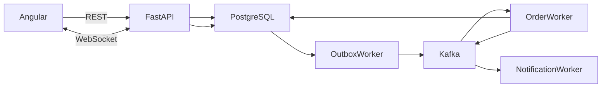
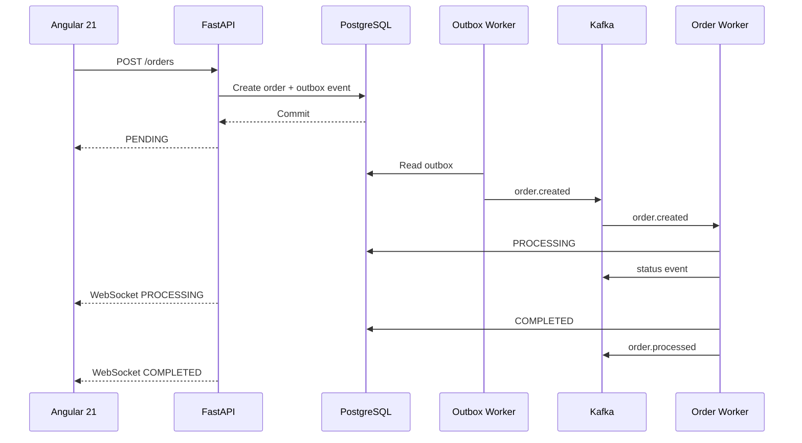

# Build a Production-Style Full-Stack Learning Project: Real-Time Order Processing System

Act as a **Senior Full-Stack Engineer, Python Backend Engineer, Angular Architect, and Distributed Systems Architect**.

Build a complete, runnable **production-style learning/demo application** that demonstrates:

### Frontend

* Angular 21
* Standalone Components
* Signals
* RxJS
* HttpClient
* WebSocket
* Reactive Forms
* Angular Router
* Lazy Loading
* Modern Angular control flow
* Component-based architecture

### Backend

* Python 3.12+
* FastAPI
* Pydantic
* SQLAlchemy 2.x
* Alembic
* PostgreSQL
* Apache Kafka
* Kafka Producer
* Kafka Consumer
* Background Workers
* Transactional Outbox
* Idempotency
* Retry
* Dead-Letter Queue

### Infrastructure

* Docker
* Docker Compose
* Kafka UI

### Testing

* Pytest
* HTTPX
* Angular unit tests
* Angular HTTP testing
* WebSocket testing where practical

---

# 1. Project Goal

Build a **Real-Time Order Processing System**.

The purpose is to learn how a modern frontend communicates with an event-driven backend.

The complete architecture should demonstrate:

```text
                         Angular 21
                             │
              ┌──────────────┴──────────────┐
              │                             │
          REST/HTTP                      WebSocket
              │                             │
              ▼                             │
         FastAPI API                        │
              │                             │
              ▼                             │
         PostgreSQL                         │
              │                             │
              ▼                             │
       Transactional Outbox                 │
              │                             │
              ▼                             │
        Outbox Worker                       │
              │                             │
              ▼                             │
            Kafka                           │
              │                             │
       ┌──────┴─────────┐                   │
       ▼                ▼                   │
 Order Worker    Notification Worker        │
       │                                    │
       ▼                                    │
 PostgreSQL                                 │
       │                                    │
       └──────────── Status Event ──────────┘
```

The user should be able to create an order and **watch its status change in real time without refreshing the browser**.

---

# 2. Core User Experience

The application should have an **Order Management Dashboard**.

The user can:

1. View dashboard statistics
2. Create an order
3. View all orders
4. Open order details
5. Watch order processing in real time
6. See the order lifecycle
7. See event history
8. See failed orders
9. Retry a failed order
10. Monitor Kafka-driven processing

Example:

```text
Create Order
     │
     ▼
PENDING
     │
     │ Kafka event
     ▼
PROCESSING
     │
     │ Background Worker
     ▼
COMPLETED
```

The Angular UI should automatically update:

```text
PENDING → PROCESSING → COMPLETED
```

without manually refreshing the page.

---

# 3. Frontend Technology

Use:

## Angular 21

Use modern Angular architecture.

Prefer:

* Standalone components
* Signals
* Computed signals
* Effects where appropriate
* RxJS
* Functional route guards/interceptors where applicable
* `inject()`
* Modern Angular template control flow
* Lazy-loaded routes

Do NOT use:

* NgModules unless genuinely required
* Deprecated Angular patterns
* Unnecessary state-management libraries

Do not introduce NgRx unless there is a strong architectural reason.

For this learning project, demonstrate how **Angular Signals + RxJS** can handle application state without NgRx.

---

# 4. Angular Project Structure

Use a clean structure such as:

```text
frontend/
│
├── src/
│   ├── app/
│   │
│   ├── core/
│   │   ├── services/
│   │   │   ├── api.service.ts
│   │   │   ├── websocket.service.ts
│   │   │   └── notification.service.ts
│   │   │
│   │   ├── interceptors/
│   │   └── models/
│   │
│   ├── features/
│   │   ├── dashboard/
│   │   │
│   │   ├── orders/
│   │   │   ├── components/
│   │   │   ├── pages/
│   │   │   ├── services/
│   │   │   └── store/
│   │   │
│   │   └── events/
│   │
│   ├── shared/
│   │   ├── components/
│   │   ├── pipes/
│   │   └── directives/
│   │
│   ├── app.routes.ts
│   └── app.config.ts
│
├── public/
├── angular.json
├── package.json
└── tsconfig.json
```

Improve the structure if there is a better Angular 21 approach.

---

# 5. Angular Routing

Create:

```text
/
├── dashboard
├── orders
├── orders/new
├── orders/:id
└── events
```

Use lazy loading for feature areas.

Example:

```text
/dashboard
/orders
/events
```

Explain Angular lazy loading and why it is useful.

---

# 6. Angular Dashboard

Create a dashboard containing:

```text
┌─────────────────────────────────────────────┐
│ Order Processing Dashboard                  │
├─────────────┬─────────────┬─────────────────┤
│ Total Orders│ Processing  │ Completed       │
│     120     │      8      │      105        │
├─────────────┴─────────────┴─────────────────┤
│                                             │
│ Recent Orders                               │
│                                             │
│ ID     Customer    Amount      Status       │
│ 1001   101         ₹1199       COMPLETED    │
│ 1002   102         ₹899        PROCESSING   │
│ 1003   103         ₹499        FAILED       │
│                                             │
└─────────────────────────────────────────────┘
```

Dashboard values should be derived using Signals.

---

# 7. Create Order UI

Create an Angular Reactive Form.

Fields:

```text
Customer ID

Products
 ├── Product ID
 ├── Quantity
 └── Price

Add Item
Remove Item

Total Amount

[Create Order]
```

Use:

* Reactive Forms
* FormArray
* Validators
* Typed forms
* Signals where appropriate

Display validation errors clearly.

---

# 8. Order List

Create an order table.

Columns:

```text
Order ID
Customer
Total
Status
Created At
Actions
```

Support:

```text
Pagination
Filtering
Status filtering
Refresh
```

Example statuses:

```text
PENDING
PROCESSING
COMPLETED
FAILED
```

Use Signals for UI state.

---

# 9. Order Details

Create:

```text
Order #1001

Customer: 101
Total: ₹1,199.97

Status:
████████████████████ COMPLETED

Timeline:

10:30:01  Order Created
10:30:02  Order Processing
10:30:05  Order Completed
10:30:05  Notification Sent
```

The status should update automatically through WebSocket events.

---

# 10. Angular Signals Architecture

Use Signals for application state.

For example:

```typescript
orders = signal<Order[]>([]);

selectedOrder = signal<Order | null>(null);

loading = signal(false);

error = signal<string | null>(null);

processingOrders = computed(() =>
  this.orders().filter(order => order.status === 'PROCESSING')
);

completedOrders = computed(() =>
  this.orders().filter(order => order.status === 'COMPLETED')
);
```

Explain:

* `signal()`
* `computed()`
* `effect()`
* Reading signals in templates
* Updating signals
* Why Signals are useful for local application state

Do not blindly convert every RxJS Observable into a Signal.

Explain when to use Signals and when to use RxJS.

---

# 11. RxJS Architecture

Use RxJS where it provides value.

Use RxJS for:

* HTTP streams
* WebSocket streams
* Event streams
* Debouncing
* Combining streams
* Error handling
* Cancellation

Demonstrate operators such as:

```text
map
filter
tap
catchError
switchMap
mergeMap
distinctUntilChanged
debounceTime
takeUntilDestroyed
```

Do not use RxJS operators just for demonstration.

Explain why each operator is being used.

---

# 12. Signals + RxJS Integration

Demonstrate:

```text
HTTP Observable
       │
       ▼
     Signal
       │
       ▼
 Angular UI
```

And:

```text
WebSocket Observable
       │
       ▼
 Signal Store
       │
       ▼
 Order Details UI
```

Use Angular's modern Signal/RxJS interoperability utilities where appropriate.

Explain:

* Observable vs Signal
* Push-based streams
* State vs events
* When to use each

---

# 13. Real-Time WebSocket Updates

Implement a FastAPI WebSocket endpoint:

```text
/ws/orders
```

or:

```text
/ws/orders/{order_id}
```

Prefer a design that allows the frontend to subscribe to a specific order.

Example:

```text
Angular
   │
   │ WebSocket
   ▼
FastAPI WebSocket
   │
   ▼
Order Event Manager
```

When the order status changes:

```text
PROCESSING
```

send:

```json
{
  "event_type": "OrderStatusChanged",
  "order_id": 1001,
  "status": "PROCESSING",
  "timestamp": "2026-09-02T10:30:05Z"
}
```

Then:

```text
COMPLETED
```

send another event.

The Angular UI must update automatically.

---

# 14. WebSocket Service in Angular

Create:

```text
websocket.service.ts
```

Responsibilities:

* Connect
* Disconnect
* Reconnect
* Receive events
* Expose an Observable
* Handle connection errors
* Clean up subscriptions

Example conceptual API:

```typescript
orderEvents$ = this.websocketService
  .connect(orderId);
```

Use RxJS for the event stream.

Then update Signals when events arrive.

---

# 15. WebSocket Reconnection

Implement basic reconnection.

If:

```text
WebSocket
    ↓
Connection lost
```

then:

```text
Retry
  ↓
Reconnect
  ↓
Resume updates
```

Use RxJS appropriately.

Explain:

* Why WebSocket connections fail
* Why reconnect logic is required
* Why uncontrolled reconnect loops are dangerous

---

# 16. Real-Time Order Lifecycle

Demonstrate this exact flow:

```text
Angular
   │
   │ POST /orders
   ▼
FastAPI
   │
   ▼
PostgreSQL
   │
   ▼
Outbox
   │
   ▼
Kafka
   │
   ▼
Order Worker
   │
   ├── PROCESSING
   │
   └── COMPLETED
            │
            ▼
       Status Event
            │
            ▼
       WebSocket
            │
            ▼
        Angular
            │
            ▼
 UI automatically updates
```

This should be the central learning feature.

---

# 17. Backend REST APIs

Implement:

```http
POST /api/v1/orders

GET /api/v1/orders

GET /api/v1/orders/{order_id}

POST /api/v1/orders/{order_id}/retry

GET /api/v1/orders/{order_id}/events

GET /api/v1/dashboard/stats

GET /health
```

---

# 18. Database

Use PostgreSQL.

Tables:

```text
orders
order_items
outbox_events
processed_events
order_events
```

## orders

```text
id
customer_id
status
total_amount
created_at
updated_at
```

## order_items

```text
id
order_id
product_id
quantity
price
created_at
```

## outbox_events

```text
id
event_id
event_type
aggregate_type
aggregate_id
payload
status
created_at
published_at
```

## processed_events

```text
event_id
consumer_name
processed_at
```

## order_events

```text
id
order_id
event_type
status
payload
created_at
```

Use:

* Foreign keys
* Constraints
* Indexes
* Transactions

---

# 19. Transactional Outbox

Do NOT directly perform:

```text
INSERT order
    ↓
Publish Kafka
```

Instead:

```text
BEGIN TRANSACTION

Create Order

Create Outbox Event

COMMIT
```

Then:

```text
Outbox Worker
      │
      ▼
    Kafka
```

Explain the dual-write problem.

Explain why the Outbox Pattern improves reliability.

---

# 20. Kafka Topics

Create:

```text
order.created
order.processed
order.failed
notification.requested
```

Optional:

```text
order.created.dlq
```

Use JSON events.

Every event should contain:

```json
{
  "event_id": "uuid",
  "event_type": "OrderCreated",
  "event_version": 1,
  "occurred_at": "...",
  "order_id": 1001
}
```

---

# 21. Kafka Consumer Groups

Use separate consumer groups:

```text
order-worker-group

notification-worker-group
```

Explain:

* Consumer group
* Partition
* Offset
* Message key
* Consumer scaling

Use:

```text
order_id
```

as the Kafka message key.

Explain why message keys matter.

---

# 22. Order Worker

Create a separate Python worker.

Responsibilities:

```text
Consume order.created
       ↓
Validate event
       ↓
Check idempotency
       ↓
Update PROCESSING
       ↓
Perform business logic
       ↓
Update COMPLETED
       ↓
Create order event
       ↓
Publish order.processed
```

The worker must not be part of the FastAPI request process.

Explain why.

---

# 23. Notification Worker

Consume:

```text
order.processed
```

Then simulate:

```text
Email notification
```

Log:

```text
Notification sent for order 1001
```

Also create an appropriate event:

```text
notification.requested
```

where useful.

---

# 24. Idempotency

Kafka consumers must handle duplicate messages.

Use:

```text
processed_events
```

with:

```text
event_id
consumer_name
```

Flow:

```text
Kafka Message
      │
      ▼
event_id already processed?
      │
   ┌──┴──┐
   │     │
  YES    NO
   │     │
Ignore   Process
         │
         ▼
   Save event_id
```

Explain at-least-once delivery.

---

# 25. Retry + Dead Letter Queue

Implement retry logic.

Example:

```text
Attempt 1
   ↓
Failure

Attempt 2
   ↓
Failure

Attempt 3
   ↓
Failure

Maximum retries reached
   ↓
DLQ
```

Use:

```text
order.created.dlq
```

Explain:

* transient failure
* permanent failure
* retry
* poison message
* DLQ

---

# 26. Real-Time Event History

Persist important order events in PostgreSQL.

Example:

```text
Order #1001

10:30:01  OrderCreated
10:30:02  ProcessingStarted
10:30:05  OrderProcessed
10:30:05  NotificationRequested
10:30:06  NotificationSent
```

Expose:

```http
GET /api/v1/orders/{order_id}/events
```

Angular should display these as a timeline.

---

# 27. Docker Architecture

Create:

```text
docker-compose.yml
```

Services:

```text
frontend
api
postgres
kafka
kafka-ui
order-worker
notification-worker
outbox-worker
```

The entire application should start with:

```bash
docker compose up --build
```

Only Docker/Docker Compose should be required.

No local:

```text
Node.js
npm
Python
PostgreSQL
Kafka
```

installation should be required.

---

# 28. Frontend Dockerfile

Create a multi-stage Angular Docker build.

Conceptually:

```text
Angular source
      ↓
Node build environment
      ↓
Production build
      ↓
Nginx
```

Serve the Angular production application using Nginx.

Explain why multi-stage builds are useful.

---

# 29. Environment Configuration

Use:

```text
.env.example
```

Backend:

```env
DATABASE_URL=...
KAFKA_BOOTSTRAP_SERVERS=...
```

Frontend should have an appropriate environment/configuration mechanism for:

```text
API_BASE_URL
WEBSOCKET_URL
```

Do not hard-code infrastructure URLs throughout the application.

---

# 30. Health Checks

Implement health checks for:

```text
Angular
FastAPI
PostgreSQL
Kafka
Workers
```

FastAPI:

```http
GET /health
```

Return dependency status.

Explain why:

```text
process is running
```

does not necessarily mean:

```text
service is healthy
```

---

# 31. Error Handling

Backend:

* Pydantic validation
* HTTP exceptions
* Database errors
* Kafka errors
* Worker errors
* Structured logging

Frontend:

* API errors
* WebSocket errors
* Loading states
* Empty states
* Retry UI
* User-friendly error messages

---

# 32. Angular UI States

Every important screen should handle:

```text
Loading
Success
Empty
Error
Retry
```

For example:

```text
Loading orders...

No orders found.

Unable to load orders.
[Retry]
```

---

# 33. Angular HTTP Interceptor

Create an HTTP interceptor where useful.

Demonstrate:

* Common headers
* Error handling
* Request logging
* Loading state

Do not add authentication unless needed for the learning objective.

---

# 34. Testing

## Backend

Use:

```text
Pytest
HTTPX
```

Test:

* API endpoints
* validation
* order creation
* order total calculation
* status transitions
* idempotency
* retry logic

## Frontend

Test:

* Components
* Signals
* Services
* HTTP requests
* Form validation
* Order status updates
* WebSocket event handling

Explain the difference between:

```text
Unit Test
Integration Test
End-to-End Test
```

---

# 35. Kafka UI

Include Kafka UI.

Use it to inspect:

```text
Topics
Partitions
Messages
Consumer Groups
Offsets
```

The README should explain how to observe:

```text
order.created
      ↓
order.processed
      ↓
notification.requested
```

while creating an order from Angular.

---

# 36. Demonstration Scenario

The README must provide a complete end-to-end demonstration.

Start:

```bash
docker compose up --build
```

Open Angular.

Create an order.

Immediately show:

```text
Angular
  ↓
POST /orders
  ↓
PENDING
```

Then without refreshing:

```text
PENDING
   ↓
PROCESSING
   ↓
COMPLETED
```

The Angular UI should update automatically through WebSocket.

At the same time, show:

```text
Kafka UI
```

and demonstrate the events.

---

# 37. Architecture Diagrams

Include Mermaid diagrams for:

## Overall Architecture



## Event Flow



---

# 38. Important Learning Topics

After implementation, explain these concepts.

## Angular

* Angular 21 standalone architecture
* Signals
* Computed Signals
* Effects
* RxJS
* Observable vs Signal
* Reactive Forms
* Lazy loading
* HttpClient
* WebSocket
* Change detection
* Component communication

## FastAPI

* Routing
* Dependency Injection
* Pydantic
* Async programming
* WebSockets
* REST API design

## PostgreSQL

* Transactions
* Foreign keys
* Indexes
* Isolation
* SQLAlchemy
* Alembic

## Kafka

* Producer
* Consumer
* Topic
* Partition
* Offset
* Consumer Group
* Message key
* At-least-once delivery

## Distributed Systems

* Eventual consistency
* Idempotency
* Retry
* DLQ
* Transactional Outbox
* Dual-write problem
* Failure recovery

---

# 39. Interview Questions

Provide detailed answers to:

### Angular

1. Why use Signals instead of RxJS for state?
2. When should RxJS be preferred?
3. Observable vs Signal?
4. How would you handle WebSocket reconnection?
5. How does Angular update the UI when a Signal changes?
6. How would you prevent memory leaks?
7. Why use standalone components?
8. How would you optimize the order table?

### FastAPI

9. Why use async FastAPI?
10. What happens when a background task blocks the event loop?
11. How does FastAPI handle WebSockets?
12. How should database sessions be managed?

### Kafka

13. Why Kafka instead of direct HTTP communication?
14. What is a partition?
15. What is a consumer group?
16. What happens if a consumer crashes?
17. What happens if the same event is delivered twice?
18. Why use `order_id` as a Kafka key?

### Distributed Systems

19. What is eventual consistency?
20. What is idempotency?
21. What is the dual-write problem?
22. Why use the Transactional Outbox Pattern?
23. What is at-least-once delivery?
24. How would you guarantee reliable event processing?
25. How would you scale the workers?
26. What happens when PostgreSQL is unavailable?
27. What happens when Kafka is unavailable?
28. How would you process 100,000 orders per second?

---

# 40. Learning Exercises

After completing the base application, provide exercises in increasing difficulty.

## Beginner

1. Add a customer name.
2. Add product names.
3. Add order search.
4. Add date filtering.
5. Add a dark mode.
6. Add order sorting.
7. Add pagination.
8. Add a confirmation dialog.
9. Add a loading spinner.
10. Add toast notifications.

## Intermediate

11. Add order cancellation.
12. Add a `CANCELLED` status.
13. Add another Kafka consumer.
14. Add a payment worker.
15. Add payment status.
16. Add WebSocket notifications.
17. Add retry controls.
18. Add DLQ monitoring.
19. Add event replay.
20. Add Kafka consumer metrics.

## Advanced

21. Add multiple Kafka partitions.
22. Run multiple order workers.
23. Demonstrate consumer-group load balancing.
24. Implement exponential backoff.
25. Implement circuit breaker behavior.
26. Add Redis caching.
27. Add Prometheus metrics.
28. Add distributed tracing.
29. Load-test the API.
30. Design the system for 100,000 orders/second.

---

# 41. Final Learning Objective

At the end, I should be able to explain this architecture confidently:

```text
Angular 21
   │
   ├── Signals → UI State
   │
   ├── RxJS → HTTP/WebSocket/Event Streams
   │
   ▼
FastAPI
   │
   ├── REST API
   ├── WebSocket
   │
   ▼
PostgreSQL
   │
   └── Transactional Outbox
              │
              ▼
          Kafka
              │
       ┌──────┴──────┐
       ▼             ▼
Order Worker   Notification Worker
       │
       ▼
PostgreSQL
       │
       ▼
WebSocket
       │
       ▼
Angular Signals
       │
       ▼
Real-Time UI
```

The final application must be **fully runnable**, with complete source code, Docker configuration, database migrations, Kafka configuration, Angular frontend, backend workers, tests, README, architecture diagrams, and an end-to-end demonstration.

Do not merely describe the application. **Actually implement the complete project.**

For every major architectural decision, explain:

1. What problem it solves
2. Why this technology is being used
3. What alternative approaches exist
4. What trade-offs are involved
5. What interview questions could be asked about it
