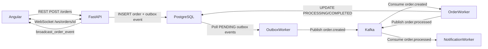
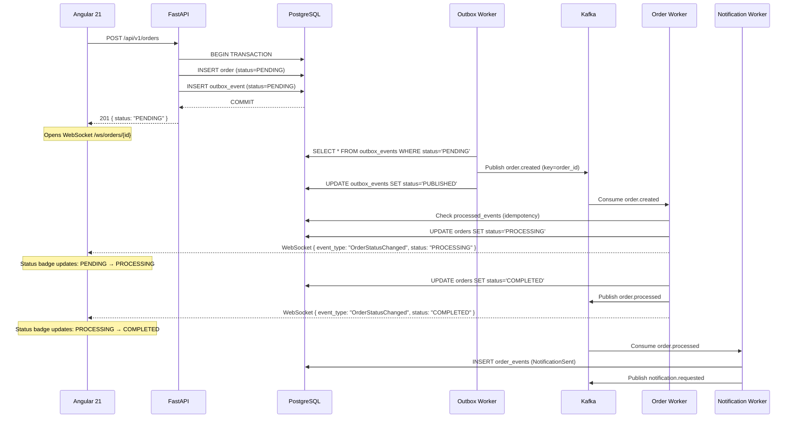
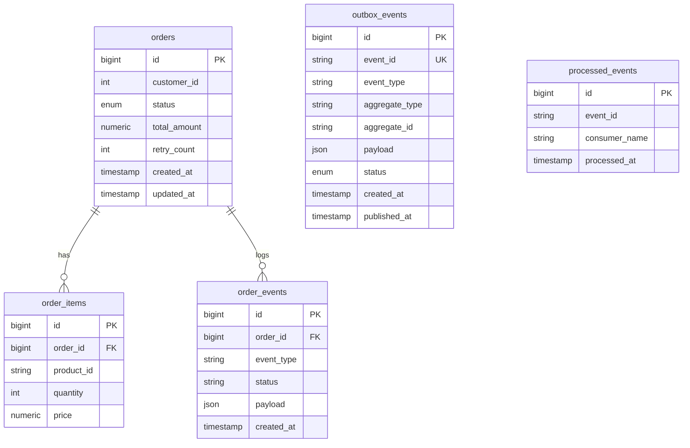

# Real-Time Order Processing System

A **production-style, full-stack learning application** demonstrating how a modern Angular 21 frontend communicates with an event-driven Python backend through REST, WebSocket, Apache Kafka, and the Transactional Outbox Pattern.

```
Angular 21  ──REST──▶  FastAPI  ──▶  PostgreSQL
    │                                    │
    │                            Transactional Outbox
    │                                    │
    ◀─────────WebSocket─────────  Outbox Worker  ──▶  Kafka
                                          │
                              ┌───────────┴────────────┐
                              ▼                        ▼
                        Order Worker           Notification Worker
                              │
                         PostgreSQL
                              │
                         Status Event  ──▶  WebSocket  ──▶  Angular UI
```

The user creates an order and watches it transition from **PENDING → PROCESSING → COMPLETED** in the browser without refreshing.

---

## Quick Start

```bash
# 1. Copy environment config
cp .env.example .env

# 2. Start everything
docker compose up --build

# 3. Open the app
open http://localhost:4200          # Angular UI
open http://localhost:8080          # Kafka UI
open http://localhost:8000/docs     # FastAPI Swagger
```

**No local Node.js, Python, PostgreSQL, or Kafka installation required.**

---

## Architecture Overview

### Overall Architecture



### Event Flow Sequence



### Database Schema



---

## Project Structure

```
.
├── backend/
│   ├── app/
│   │   ├── main.py              # FastAPI app, lifespan, CORS
│   │   ├── config.py            # Pydantic Settings
│   │   ├── database.py          # SQLAlchemy async engine + session
│   │   ├── models.py            # ORM models (Order, OrderItem, Outbox, etc.)
│   │   ├── schemas.py           # Pydantic v2 request/response schemas
│   │   ├── kafka_client.py      # Shared aiokafka producer + topic constants
│   │   ├── websocket_manager.py # In-process WebSocket broadcast manager
│   │   └── routers/
│   │       ├── orders.py        # REST: POST/GET/RETRY orders
│   │       ├── dashboard.py     # GET /dashboard/stats
│   │       └── websocket.py     # WS: /ws/orders, /ws/orders/{id}
│   ├── workers/
│   │   ├── outbox_worker.py     # Polls DB → publishes to Kafka
│   │   ├── order_worker.py      # Consumes order.created → PROCESSING/COMPLETED
│   │   └── notification_worker.py # Consumes order.processed → sends notification
│   ├── alembic/                 # Database migrations
│   ├── tests/
│   │   ├── conftest.py          # Pytest fixtures (in-memory SQLite, HTTPX client)
│   │   └── test_orders.py       # API endpoint + unit tests
│   ├── Dockerfile
│   ├── requirements.txt
│   └── pytest.ini
│
├── frontend/
│   └── src/app/
│       ├── core/
│       │   ├── models/          # TypeScript interfaces
│       │   ├── services/        # ApiService, WebSocketService, NotificationService
│       │   └── interceptors/    # HTTP error interceptor
│       ├── features/
│       │   ├── dashboard/       # Dashboard with stats + recent orders
│       │   ├── orders/
│       │   │   ├── pages/       # OrderList, OrderDetail, CreateOrder
│       │   │   └── store/       # OrderStore (Signals + RxJS)
│       │   └── events/          # Live event log page
│       ├── shared/
│       │   ├── components/      # ToastComponent
│       │   └── pipes/           # StatusBadgePipe, StatusProgressPipe
│       ├── app.routes.ts        # Lazy-loaded routes
│       └── app.config.ts        # Application providers
│
├── docker-compose.yml
├── .env.example
└── README.md
```

---

## Core Concepts Explained

### Why the Transactional Outbox Pattern?

**The dual-write problem:** If you do this:

```python
# ❌ DANGEROUS — these are two separate operations
db.add(order)
db.commit()
kafka.publish("order.created", order)  # What if THIS crashes?
```

A crash between `db.commit()` and `kafka.publish()` leaves the order in the DB but no Kafka message was sent — the order silently never gets processed.

**The fix — Transactional Outbox:**

```python
# ✅ SAFE — both happen in ONE database transaction
async with db:
    db.add(order)                          # INSERT order
    db.add(OutboxEvent(payload=order_data)) # INSERT outbox_event
    await db.commit()                      # COMMIT BOTH or NEITHER
# Outbox Worker reads outbox_events and publishes to Kafka independently
```

Either both the order AND the outbox event are committed, or neither is. The Outbox Worker retries publishing until it succeeds.

### Why Idempotency in Kafka Consumers?

Kafka guarantees **at-least-once delivery** — a message may be delivered more than once if the consumer crashes after processing but before committing the offset.

Without idempotency, the same order would be processed twice:

```
# ❌ Without idempotency
Kafka delivers order.created for order #1001
Worker processes order #1001 → COMPLETED
Worker CRASHES before committing offset
Kafka re-delivers order.created for order #1001  ← DUPLICATE
Worker processes order #1001 AGAIN → double charge?
```

**Fix — check `processed_events` table:**

```python
# ✅ With idempotency
if await is_already_processed(event_id, consumer_name):
    return  # Skip — already handled
process_order(event)
mark_processed(event_id, consumer_name)  # Record in same transaction
```

### Why Separate Workers from the API?

| API (FastAPI)         | Workers (Python processes) |
|-----------------------|---------------------------|
| Handles HTTP requests | Handles Kafka messages     |
| Must respond fast (<200ms) | Can take seconds/minutes |
| Stateless, horizontally scalable | Scale independently |
| Unavailability = user error | Unavailability = delayed processing |

Putting long-running work (payment processing, notifications) in the API request would:
1. Make requests slow
2. Tie API availability to Kafka availability
3. Prevent independent scaling

### Angular Signals vs RxJS

| Use Signals for... | Use RxJS for... |
|-------------------|-----------------|
| Current UI state (loading, error) | HTTP streams |
| Selected item, filter values | WebSocket event streams |
| Derived/computed values | Combining multiple streams |
| Synchronous, readable state | Operators: debounce, retry, switchMap |
| Reading in templates | Cancellation (switchMap) |

**Integration pattern used in this project:**

```typescript
// RxJS Observable (event stream) → Signal (state)
this.websocketService
  .connectOrder(orderId)                    // Observable<WebSocketEvent>
  .pipe(
    filter(e => e.event_type === 'OrderStatusChanged'),
    takeUntilDestroyed()                    // Auto-cleanup
  )
  .subscribe(event => {
    this.order.update(o => ({...o, status: event.status})); // Signal update
  });
```

```typescript
// In the template — reads Signal synchronously:
{{ order().status }}   // ← Angular knows to re-render when order() changes
```

### Angular Lazy Loading

```typescript
// app.routes.ts
{
  path: 'orders',
  loadComponent: () =>
    import('./features/orders/pages/order-list/order-list.component')
      .then(m => m.OrderListComponent)    // ← Dynamic import = separate JS chunk
}
```

Without lazy loading: **all 5 feature chunks loaded on startup** (~400 KB extra).
With lazy loading: each feature chunk loads **only when that route is visited**.

---

## API Reference

| Method | Endpoint | Description |
|--------|----------|-------------|
| `POST` | `/api/v1/orders` | Create a new order |
| `GET` | `/api/v1/orders` | List orders (paginated, filterable) |
| `GET` | `/api/v1/orders/{id}` | Get order with items + events |
| `POST` | `/api/v1/orders/{id}/retry` | Retry a FAILED order |
| `GET` | `/api/v1/orders/{id}/events` | Get event timeline |
| `GET` | `/api/v1/dashboard/stats` | Dashboard statistics |
| `GET` | `/health` | Deep health check |
| `WS` | `/ws/orders` | Global order event stream |
| `WS` | `/ws/orders/{id}` | Per-order event stream |

---

## Kafka Topics

| Topic | Producer | Consumer | Description |
|-------|----------|----------|-------------|
| `order.created` | Outbox Worker | Order Worker | New orders ready to process |
| `order.processed` | Order Worker | Notification Worker | Successfully processed orders |
| `order.failed` | Order Worker | — | Failed orders (audit) |
| `notification.requested` | Notification Worker | — | Notification audit trail |
| `order.created.dlq` | Order Worker | — | Dead-letter queue (max retries) |

**Message key = `order_id`** — ensures all events for the same order land on the same Kafka partition, guaranteeing ordering.

---

## End-to-End Demo Scenario

### Step 1: Start everything

```bash
docker compose up --build
# Wait ~60s for Kafka to be ready
```

### Step 2: Open the UI

```
http://localhost:4200
```

### Step 3: Open Kafka UI in a second tab

```
http://localhost:8080
```
Navigate to: **Topics → order.created → Messages**

### Step 4: Create an order

1. Click **"➕ New Order"** in the sidebar
2. Enter Customer ID: `101`
3. Add a product: `PROD-001`, quantity: `2`, price: `499.50`
4. Click **"📦 Create Order"**
5. You are redirected to the Order Detail page

### Step 5: Watch real-time updates

The Order Detail page shows:
```
Status: PENDING   → (1-2 seconds) → PROCESSING → (1-3 seconds) → COMPLETED
```

The status badge and progress bar update **automatically via WebSocket** without any page refresh.

### Step 6: Observe Kafka messages

In Kafka UI (http://localhost:8080), you should see:

**`order.created`** topic — message published by the Outbox Worker:
```json
{
  "event_id": "550e8400-...",
  "event_type": "OrderCreated",
  "event_version": 1,
  "occurred_at": "2024-01-01T10:30:01Z",
  "order_id": 1,
  "customer_id": 101,
  "total_amount": 999.00
}
```

**`order.processed`** topic — published by Order Worker after COMPLETED:
```json
{
  "event_id": "processed-550e8400-...",
  "event_type": "OrderProcessed",
  "order_id": 1
}
```

**`notification.requested`** topic — published by Notification Worker:
```json
{
  "event_type": "NotificationRequested",
  "order_id": 1,
  "channel": "email"
}
```

### Step 7: Check consumer groups

In Kafka UI → **Consumer Groups**:
- `order-worker-group` — Order Worker offset
- `notification-worker-group` — Notification Worker offset

Both groups should show **lag = 0** (all messages consumed).

### Step 8: Test the Event Timeline

Click the **"⟳ Refresh"** button on the Order Detail page to see:
```
10:30:01  OrderCreated        status → PENDING
10:30:02  ProcessingStarted   status → PROCESSING
10:30:04  OrderCompleted      status → COMPLETED
10:30:05  NotificationSent
```

### Step 9: Test retry flow

1. Create another order
2. Manually stop the order-worker: `docker compose stop order-worker`
3. Create a new order — it will stay PENDING
4. Restart: `docker compose start order-worker`
5. The worker consumes the backlog and processes the order

---

## Running Tests

### Backend

```bash
cd backend

# Install deps (with aiosqlite for in-memory test DB)
pip install -r requirements.txt aiosqlite

# Run all tests
pytest

# With coverage
pytest --cov=app --cov-report=term-missing
```

### Frontend

```bash
cd frontend
npm ci
npm test                    # Run in headless Chrome
npm run test:coverage       # With coverage report
```

---

## Services & Ports

| Service | URL | Description |
|---------|-----|-------------|
| Angular UI | http://localhost:4200 | Frontend application |
| FastAPI | http://localhost:8000 | REST API + WebSocket |
| FastAPI Docs | http://localhost:8000/docs | Swagger UI |
| Kafka UI | http://localhost:8080 | Kafka topic/message browser |
| PostgreSQL | localhost:5432 | Database (dev access) |
| Kafka | localhost:9092 | Kafka broker |

---

## Key Design Decisions

### Why KRaft Kafka (no Zookeeper)?

Kafka 3.7 supports KRaft mode — Kafka manages its own metadata without Zookeeper. Simpler to run in Docker (one less service, no port 2181 to manage).

### Why asyncpg (not psycopg2)?

asyncpg is a native async PostgreSQL driver. It never blocks the event loop during DB queries, allowing FastAPI to handle thousands of concurrent requests on a single thread.

### Why `SKIP LOCKED` in the Outbox Worker?

```sql
SELECT * FROM outbox_events WHERE status='PENDING'
FOR UPDATE SKIP LOCKED
```

If you run multiple outbox worker instances, `FOR UPDATE` prevents two workers from publishing the same event. `SKIP LOCKED` means other workers skip rows already locked by a peer — they pick the next available row instead of waiting.

### Why message key = `order_id`?

Kafka routes messages with the same key to the same partition. This guarantees that for order #1001:
- `order.created` event
- `order.processed` event

...are always consumed **in order** by the same consumer instance. Without this, `COMPLETED` could arrive before `PROCESSING` if they land on different partitions with different consumer lag.
